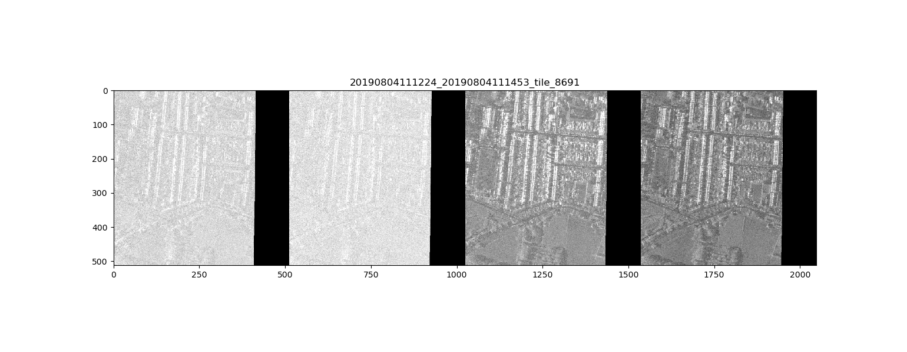

# SpaceNet6 Challenge


## Models
Unet models with different encoders from [segmentation models libruary](https://github.com/qubvel/segmentation_models.pytorch). All base models used were pre-trained on Imagenet dataset. 


## Dataset
The data were provided by th challenge orginisers. The script to download the dataset is in ```scripts/download_spacenet6_data```. The corresponding masks were uploaded on kaggle, the donload scrips is in 
```scripts/download_masks```.


## Images preprocessing and augmentations
The original images were scaled to 512 x 512 px resolution. 
First, the models were pre-trained on RGB data. For the RGB images I added the grayscale to have 4 input channes for the pre-train, similar to SAR data.
The RGB dataset is in ```src/datasets/spacenet_rgb.py```. The data were normalised as in ImageNet. 


Fig. 1 An example of RGB and grayscale data and the corresponding binary mask.

The images were agmented using [albumentations libruary](https://albumentations.readthedocs.io/en/latest/index.html). The dictionary of possible transforms is in ```src/datasets/transforms.py```


Fig. 2 Augmented RGB and grayscale data with the corresponding binary mask.

After the pre-train models were trained on 4-channel SAR data. The raw data were normalised using 98% percintile and then as in ImageNet. 
The SAR dataset is in ```src/datasets/spacenet.py```


Fig. 3 4 channels SAR data with the corresponding binary mask.

The transforms "medium" and "d4" were used for training, ""flip_bright"" for validation, see transforms in ```src/datasets/transforms.py```


Fig. 4 Augmented 4 channels SAR data.


## Prepare environment 
1. Install anaconda
2. Run ```scripts/create_env.sh``` bash file to set up the conda environment


# Training
Training script is in ```src/pretrain_runner.py``` for RGB data and in ```src/train_runner.py``` for SAR data, respectively.

Set up your own path ways in ```src/configs.py```.
Basic model: Unet Se-ResNext101
Set IMS_SIZE in configs for transforms.

## Make folds
python -m src.folds.make_folds

## Create empty masks for images with no objects
python -m src.utils.make_empty_masks

## Test the train runners
python -m src.pretrain_runner --model-name "unet_se_resnext101_32x4d" --encoder "se_resnext101_32x4d" --debug True --image-size 224 --epochs 2 --lr 1e-3 --batch-size 16 --num-workers 2

python -m src.train_runner --model-name "unet_se_resnext101_32x4d" --encoder "se_resnext101_32x4d" --debug True --image-size 224 --epochs 2 --lr 1e-3 --batch-size 16 --num-workers 2 

## Pretrain the model on RGB + grayscale images
nuhop python -m src.pretrain_runner --model-name "unet_se_resnext101_32x4d" --encoder "se_resnext101_32x4d" --image-size 512 --epochs 200 --lr 1e-3 --batch-size 6 --num-workers 4 & 
tail -f nohup.out

## Train the model on SAR data
You may use the model pretrained on RGB + grayscale images; set the --checkpoint argument
nohup python -m src.train_runner --model-name "unet_se_resnext101_32x4d" --encoder "se_resnext101_32x4d" --image-size 512 --checkpoint = '<pretrained_rgb_model>' --epochs 200 --lr 1e-3 --batch-size 6 --num-workers 4 & > nopup2.out 
tail -f nohup.out

## Run inference on the validation set
python -m src.predict --action predict_val

## Run inference on the test set
python -m src.predict --action predict_test

## Plot predictions for validation
python -m src.predict --action plot_val_preds

## Plot predictions for test
python -m src.predict --action plot_test_preds